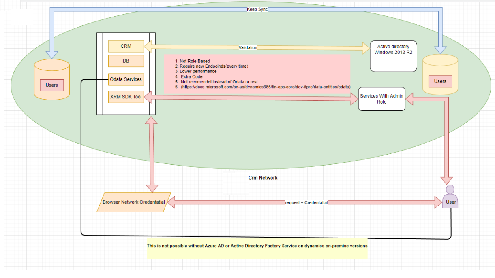
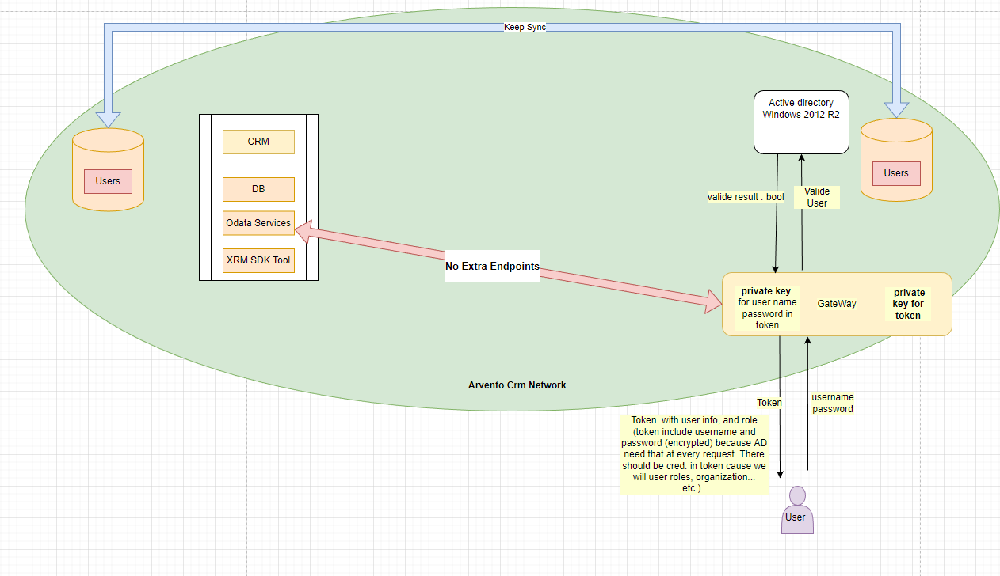

<h3>CRMODataGateway</h3>

this gateway routing crm dynamics rest/Odata requests to crm from out of newtowrk or AD domain. 
(This methods is not recomended. You should use for spesific scenarios.)  

<h3>Benefit</h3> 
<ul>
<li>No extra endpoints at backend. </li>
<li>Hihger performance than custom endpoints with xrm.sdk</li>
</ul>

<h3>Alternative and easier ways to do that</h3> 
<ul>
<li>useing Azure AD  </li>
<li>Active Directory Factory Service. </li>
</ul>
Also you can always upgrade your crm to cloud. 
<h3>Scenarios</h3>
But you have lack of newtwork/domain permissions or limitation of network users at on-premise versions(2015 release 1 or higher) this is the third options.
Also you can always upgrade your crm to cloud. 
  

Note that : "prefer", "return=representation" header available on 2016 release 1 or higher.
For 2015 rel. 1  to 2016 this header doesnt cause error but not show the query result.  

  
<h3>Basic Examples (Same as Crm Rest Services only base addres will point our gate way )</h3>

GET [Router URI instead of Organization URI]/api/data/v9.2/accounts?$select=name,revenue&$top=3   

Request  
GET [Router URI instead of Organization URI]/api/data/v9.2/accounts?$select=name 
&$top=3 HTTP/1.1  
Accept: application/json  
OData-MaxVersion: 4.0  
OData-Version: 4.0    
Response 
HTTP/1.1 200 OK   
Content-Type: application/json; odata.metadata=minimal   
OData-Version: 4.0     
{  
   "@odata.context":"[Organization URI]/api/data/v9.2/$metadata#accounts(name)",
   "value":[  
      {  
         "@odata.etag":"W/\"501097\"",
         "name":"Fourth Coffee (sample)",
         "accountid":"89390c24-9c72-e511-80d4-00155d2a68d1"
      },
      {  
         "@odata.etag":"W/\"501098\"",
         "name":"Litware, Inc. (sample)",
         "accountid":"8b390c24-9c72-e511-80d4-00155d2a68d1"
      },
      {  
         "@odata.etag":"W/\"501099\"",
         "name":"Adventure Works (sample)",
         "accountid":"8d390c24-9c72-e511-80d4-00155d2a68d1"
      }
   ]
}
   

previous architecture
  

new architecture 

   

•	CRUD support is handled through HTTP verb support for POST, PATCH, PUT, and DELETE. (in this version only have post and get but its possible to add PATCH, PUT, and DELETE ) 
•	Available query options are: 
o	$filter 
o	$count 
o	$orderby 
o	$skip 
o	$top 
o	$expand (only first-level expansion is supported) 
o	$select 
•	The OData service supports serving driven paging with a maximum page size of 10,000.  
Filter details 
There are built-in operators for $filter: 
•	Equals (eq) 
•	Not equals (ne) 
•	Greater than (gt) 
•	Greater than or equal (ge) 
•	Less than (lt) 
•	Less than or equal (le) 
•	And 
•	Or 
•	Not 
•	Addition (add) 
•	Subtraction (sub) 
•	Multiplication (mul) 
•	Division (div) 
•	Decimal division (divby) 
•	Modulo (mod) 
•	Precedence grouping ({ }) 

Validate methods 
The following table summarizes the validate methods that the OData stack calls implicitly on the corresponding data entity. 
OData	Methods (listed in the order in which they are called) 
Create	1.	Clear() 
2.	Initvalue() 
3.	PropertyInfo.SetValue() for all specified fields in the request 
4.	Validatefield() 
5.	Defaultrow 
6.	Validatewrite() 
7.	Write() 
Update	1.	Forupdate() 
2.	Reread() 
3.	Clear() 
4.	Initvalue() 
5.	PropertyInfo.SetValue() for all specified fields in the request 
6.	Validatefield() 
7.	Defaultrow() 
8.	Validatewrite() 
9.	Write() 
Delete	1.	Forupdate() 
2.	Reread() 
3.	checkRestrictedDeleteActions() 
4.	Validatedelete() 
5.	Delete() 
